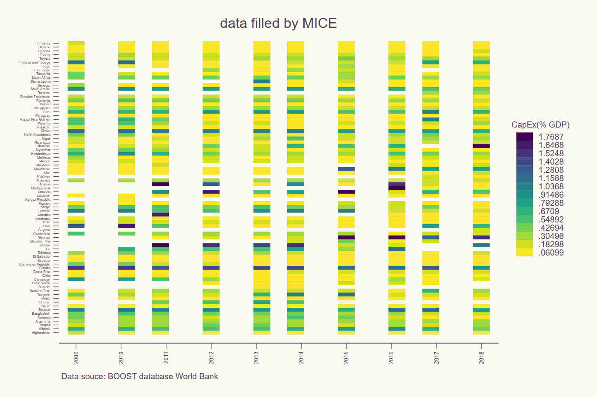

# boost_mi

> Missing values imputation by Stata mi pacakge

## About The Project

This study is a further analysis based on Global Public Expenditure Review Report Chapter 3.3 (World Bank Report, forthcoming 2023).

## Impute Missing Values Using Chained Equation with Panel Data

In this repository is a first trial of using MICE (Multiple Imputation Chained Equations) to fill missing values with Stata mi package for a panel dataset of country-level public expenditure from year 2009 to 2018. 

Addition info:

* The [boost_mi_visual1.do](./data/boost_mi_visual1.do) contains the script for original data visualization and mi computation.
* The [boost_mi_visual2.do](./data/boost_mi_visual2.do) contains the script for pattern of missing values, data visualization before- and after- mi computation.
* The [boost_panel_wss.dta](./data/boost_panel_wss.dta) contains the panel dataset of total and capital expenditure in Water, Sanitation and Supply (WSS) sector.
* The [figures](/figures) folder contains the data visualization images.

Documentation: 
[Stata mi package manual](https://www.stata.com/manuals/mimiimputechained.pdf)

Other Guide:
[UCLA Stata website using mi for panel dataset](https://stats.oarc.ucla.edu/stata/faq/how-can-i-perform-multiple-imputation-on-longitudinal-data-using-ice/)
 
## Brief description of data source

BOOST national fiscal data (2009-2018): on expenditure flows from treasury systems available from the BOOST database managed by the World Bank and funded by the Bill & Melinda Gates Foundation. In 2022, the number of countries covered in the dataset increased to 88.

o	Excludes data on private sector investments, off-budget spending by the government (due to missing data on the execution of foreign-funded spending in high-aid countries), sectoral spending if national classification data does not clearly identify sectoral spending, and investments by state owned enterprises (SOEs), except for national capital transfers. The latter is a major issue given that SOEs constitute a considerable share of the water and sanitation and the electricity sectors, and much of the transport sector. 

o	Small risk of including non-infrastructure spending

o	Available on an annual basis and allows for in-depth sectoral analysis

o	Time consuming for countries with insufficient functional classification

## Preview
### Visualization
#### traditional way to visualize panel dataset

pooled-year average by country for capital expenditure in WSS sector


pooled-country average by year for capital expenditure in WSS sector


### mi package

```stata
mi set mlong
mi reshape wide ex_ce_watersan ex_re_watersan gdp_usd_cons_2019, i(countryname) j(year)
mi register imputed ex_re_watersan* ex_ce_watersan*

mi impute chained (regress) ex_re_watersan* ex_ce_watersan*  = avg_gdp, add(50) rseed(08312022)
mi reshape long ex_ce_watersan ex_re_watersan gdp_usd_cons_2019, i(countryname) j(year)
 
```

### pattern of missing values


### pre-mi vs. after-mi for missing data



